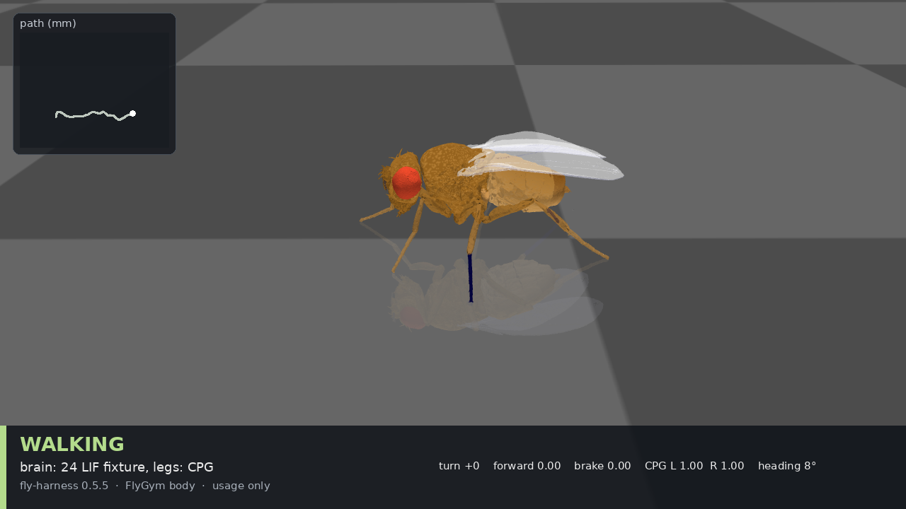
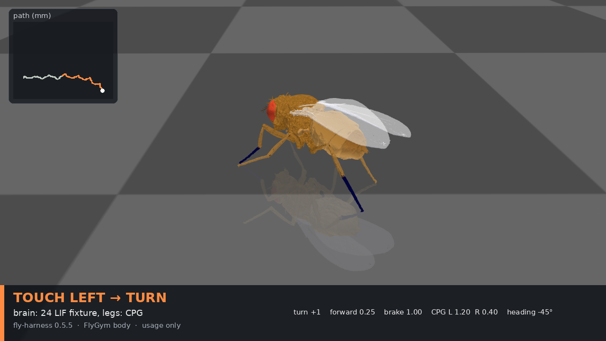
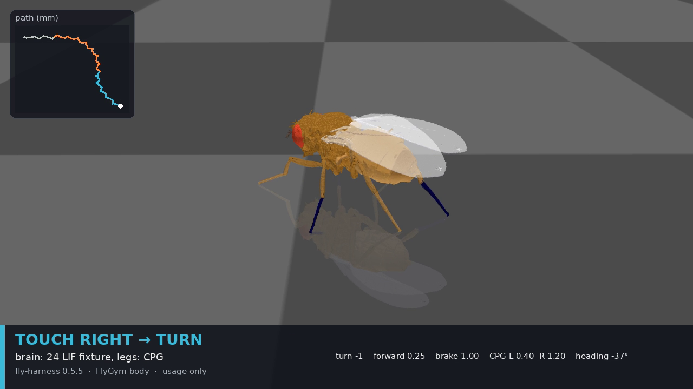

# fly-harness

[English](README.md) | [中文](README.zh-CN.md)

**v0.5.5** — fly-harness 包在生物仿真外面：obs → encode → Model.tick → decode → action。

从随包装运的 24 神经元 fixture 开始。之后如果你接入自己在跑的仿真并替换那个 Model，仍是同一条回路。

<video src="docs/media/visual-demo/fly-walking.mp4" poster="docs/media/visual-demo/01-walking.png" width="800" controls muted loop playsinline></video>

[15 秒走路（mp4）](docs/media/visual-demo/fly-walking.mp4) — NeuroMechFly 在 `FlatTerrain` 上：走路，然后左侧触觉，然后右侧触觉。

<p align="center">
  
  
  
</p>

这段片段是 **usage**，不是内核功能：脑槽是 24 神经元 LIF fixture，腿仍由 FlyGym CPG 驱动。

## 安装

Python 3.10+，依赖 `numpy` 和 `scipy`。fixture 已包含。

```bash
pip install fly-harness
fly-harness-check
```

之后替换 Model 仍是同一条 `obs → FlyHarness.step → action` 回路（`examples/swap_brain.py` / `fly-harness-swap-brain-demo`）。可选 extra（FlyGym、biorouter、flybrain）见 [docs/usage.md](docs/usage.md)。契约：[docs/docking.md](docs/docking.md)。

## 这不是什么

- 不是 166,700 神经元 MaleCNS 大脑、意识或上传
- 不是 Google 托管，不是 FlyWire 网站
- 不比 FlyGym 自己的控制器走得更好
- 不是市场、托管目录、或 OpenRouter 这家公司

## 许可证

MIT — 见 [LICENSE](LICENSE)。
